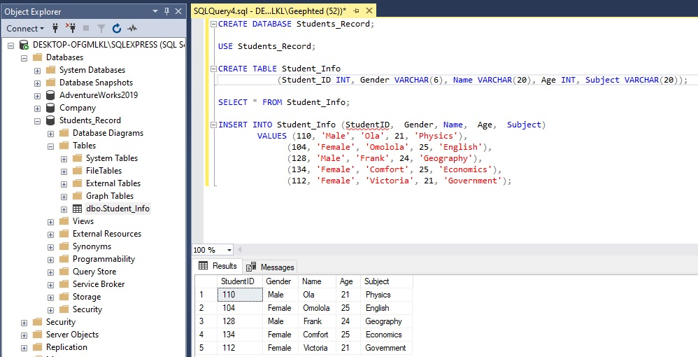
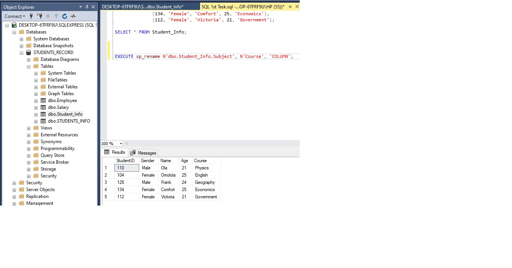

# SQL-TASK 1-3
## Introduction

This repository contains three diffrent tasks using SQL, I undertook three tasks that involved working with relational databases. These tasks required me to make modifications to tables, including creating, altering, and dropping tables etc. I also applied constraints to specific tables. Throughout these tasks, I utilized a range of SQL syntax elements such as SELECT, CREATE, DROP, ORDER BY, HAVING, and WHERE, among others.

### Data Set
We were provided with 3 datasets to use for this tasks, these dataset consist of files in a comma-separated values (CSV) format. Each row represents a unique employee, and the columns contain different attributes of the employee. 
- Employee
- Salary
- Department

## Tasks 

### Task 1
- Create a Database named “Students Record”
- Create the following tables in the database create
  Students Info  (Student ID, Gender, Name, Age, Subject),
  Health records (Student ID, Blood Group, Height, Weight),
  Performance (Student ID, Score, Grade)
- The ID has to be unique
- Where a student has no score, it should be ‘0’ by default
- Add a constraint that prevents the ID and Subject from taking null values
- Apply the following modifications to the table
    Change column name ‘’Subject” to ‘’Course” 
    Drop the “Age” column from the ‘Students Info’ table

 1. I started by initiating the creation of a new database named "STUDENT_RECORD" using SQL syntax. The screenshot displays both the SQL syntax I employed and the result after the execution of the syntax.

  

2. I began by writing SQL script, I first utilized the CREATE TABLE statement to define the "StudentInfo" table's structure. Following the table's creation, I used the INSERT INTO statement to add fictional data into the table. Each VALUES tuple represents a separate student's information. 

  

By executing the same script, I effectively also established the " Health records" table and populated it with hypothetical student data. The following screenshot displays both the SQL syntax I employed and the resultant table:

  

 Still using the same syntax, I also created the "Perfoemance" table and populated it with hypothetical student data. The following screenshot displays both the SQL syntax I employed and the resultant table:

   

3. To enforce uniqueness for the "StudentID" column in the "StudentInfo" table, I executed the following steps: First, I utilized the ALTER TABLE command to modify the "StudentInfo" table structure that I had initially created. Subsequently, I employed the ADD CONSTRAINT clause to impose a unique constraint on the "StudentID" column, ensuring that every student possesses a distinctive identifier within the table. Below is a screenshot of the syntax used and the command completed successful message.

 

 4. To ensure that a student has a default score of '0' when no score is specified, i updated the Performance table to set a default value for the score column. Additionally, i applied a constraint to enforce this default value. Here's the screenshot that show both the syntax and result table 

  

5.  I  encountered difficulties while trying to add constraints to prevent StudentID and Subject from taking null values. i resolved this by dropping the existing "StudentInfo" table and creating a new one with the desired constraints. i added the primary key constraint to the studentID column and not null constraints to the Subject column. Below is the  screenshot that show both the syntax and the result.

 

6. I initiated the rename syntax column from one of the column in the student info table from Subject to Course. Below screenshot shows both the syntax used and the result

    
   
In order for me to drop the age column from the Student Info table i initiated the drop syntax. Below is the syntax used and the result of the execution 

 

### Task 2

- Select the employee table and show the data where city is Mumbai and Delhi. 
- Select the employee table where employee first name have both ‘a’ and ‘e’  in them. 
- Subset the employee table to have employee with date of birth above 1990
- Subset the salary table to show salaries less than 1 million and sort in an ascending order

1. I retrieved records from Employee table where the city is either "Mumbai" or "Delhi." by using the logical operator OR along with the WHERE statement. Below is the screenshort of both the syntax i used and the result after executing the syntax.

    

2. To show the where employee first name have both 'A' and 'E' i used a logical operator, WHERE statement and the LIKE operator.

 

 3.To know the employees with date of bith above 1990, 

  

  4. To retrieve a subset of the salary table that includes only salaries less than 1 million and to arrange them in ascending order, i 
 used the SELECT statement along with the WHERE clause to filter the data and the ORDER BY clause to sort the results. Here's the screenshort that shows the syntax and the result 

       

### Task 3
  
